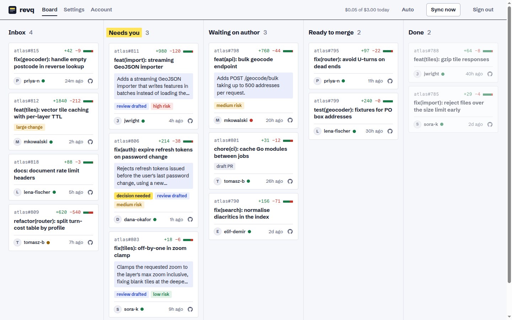

# revq

A self-hosted review queue for maintainers. revq watches the pull requests waiting on
your review, has Claude Code draft a review for each, and shows what needs you on a
kanban board. Nothing is posted to GitHub until you approve it, unless you turn that on.

Full setup, deployment and usage: the [revq guide](https://revq.dev)
(source in [docs/guide.md](docs/guide.md)).

## Run it

On a home server with Docker:

    cp .env.example .env       # fill in the tokens, see below
    docker compose up -d       # pulls ghcr.io/msyavuz/revq

Open `http://<server>:8080` and sign in as `admin` / `admin`. You're asked to set a new
password before anything else works. Then go to Settings and add a repository. Data is one SQLite
file in the `revq-data` volume. To update: `docker compose pull && docker compose up -d`.

Releases are version tags (`v0.1.0`, ...). Each one publishes the Docker image and
standalone binaries for Linux and macOS, for running without Docker.

Locally, using your existing `gh` and `claude` logins:

    go run ./cmd/revq          # http://127.0.0.1:8080

## Environment

| Variable | Default | |
|---|---|---|
| `GITHUB_TOKEN` | `gh auth token` | Reviews are posted as this token's owner. Read access is enough to draft; posting reviews or labels needs pull request write access. |
| `CLAUDE_CODE_OAUTH_TOKEN` | local `claude` login | From `claude setup-token`. Uses your Claude subscription. |
| `ANTHROPIC_API_KEY` | unset | Alternative to the OAuth token, billed per use. |
| `REVQ_ADDR` | `127.0.0.1:8080` | Listen address (`:8080` in the Docker image). |
| `REVQ_DB` | `revq.db` | SQLite file. |
| `REVQ_CLAUDE_BIN` | `claude` | Path to the Claude Code CLI. |

## How it works

**What it tracks.** Per repository, either the PRs where your review is requested plus
the ones you've already reviewed (the default), or every open PR. It polls GitHub, so it
works behind NAT with no public URL.

**The board** reads left to right. A review request lands in Inbox. Once a review is
drafted the card moves to Needs you. After
you post, it waits in Waiting on author until they push and ask again, then Ready to
merge, then Done. Drag a card to pin it somewhere
until the author pushes again. The bar on each card is the size of the change.

**The agent.** "Draft review" on a card has the agent read the diff and write a short
review made of inline comments: one-line findings anchored to the lines they are about,
plus any decision only you can make. There is no generated overview comment; the overall
comment is yours to write if you want one. You edit the draft, drop
findings you disagree with, and either post it from the PR page or hand it to GitHub as a
pending review (visible only to you) and finish it there, next to the code.

**Autonomy.** Off by default. Three switches, global with a per-repo override:

- Auto review: draft a review for every PR waiting on you, once per commit.
- Auto post: publish drafts without your approval. Always as a plain comment; approving
  or requesting changes is only ever done by you.
- Auto label: apply the labels the agent suggests, limited to labels the repo already has.

**Notifications.** A Slack-compatible webhook and/or a Telegram bot get a message when a
PR lands in Needs you.

## Token cost

- Syncing uses the GitHub API only. No model is involved.
- A review is one model call per chunk of diff. It skips lockfiles, generated and
  vendored files, packs the rest biggest-change-first into a capped number of chunks, and
  lists anything it left out on the draft.
- The agent is `claude -p` with no tools, no MCP servers, no settings and its own system
  prompt, so the fixed overhead is about 1k tokens per call. With no tools, text inside a
  PR can't make it do anything.
- A daily budget pauses the queue. A pushed commit is not re-reviewed while a draft is
  still waiting for you.

Models, budgets, diff sizes, extra ignore paths and your project's review guidelines are
on the Settings page.

## Limits

- GitHub only, one account, one token.
- The reviewer sees the diff, not a checkout of the repository.
- No automated tests yet.

## Contributing

Issues and pull requests are welcome. Read [CONTRIBUTING.md](CONTRIBUTING.md) first,
especially the part about scope.

## License

MIT. Bundled fonts (Schibsted Grotesk, Commit Mono) are under the SIL Open Font License;
their license texts are in `internal/web/static/fonts`. htmx is 0BSD.
