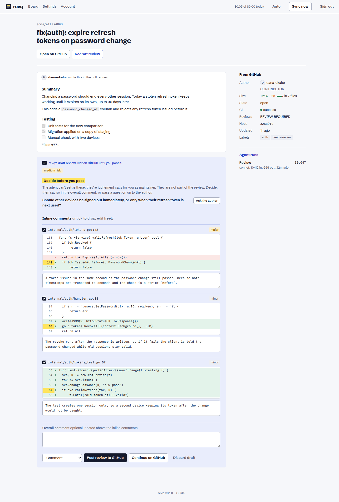

# revq guide

revq is a review queue for one maintainer. It watches the pull requests waiting on your
review, has Claude Code draft inline comments for them, and lets you approve, edit or drop
those comments before anything reaches GitHub.

## Set it up

revq needs two credentials. Both go in a `.env` file next to `compose.yml`.

### A GitHub token

revq reads pull requests and posts reviews as the owner of this token, so use a token for
your own account.

- A classic token with the `public_repo` scope covers public repositories. Use `repo` if
  you also review private ones.
- A fine-grained token works only for repositories whose owner allows them. It needs
  read and write access to pull requests, and to issues if you turn on auto label.
- A read-only token is enough to fill the board and draft reviews. Posting needs write
  access.

Put it in `.env` as `GITHUB_TOKEN`.

### Claude Code access

The agent is the `claude` command-line tool, which the Docker image already contains.
Give it one of these:

- **Your Claude subscription.** On any machine where you're signed in to Claude Code, run
  `claude setup-token` and put the result in `.env` as `CLAUDE_CODE_OAUTH_TOKEN`.
- **API billing.** Put an API key in `.env` as `ANTHROPIC_API_KEY`.

## Deploy with Docker

    git clone https://github.com/msyavuz/revq
    cd revq
    cp .env.example .env        # then fill in the two credentials
    docker compose up -d

This pulls the published image `ghcr.io/msyavuz/revq` and starts it. revq now listens
on port 8080 of the server. Open `http://<server>:8080`.

Images are built for Intel/AMD and ARM servers. `compose.yml` uses the `latest` tag;
change it to a version such as `ghcr.io/msyavuz/revq:v0.1.0` if you'd rather choose when
to update.

To build from the source checkout instead of pulling, switch the `image` line in
`compose.yml` for `build: .` as its comment describes, and run
`docker compose up -d --build`.

Everything revq stores (settings, the board, drafts, your account) is one SQLite file in
the `revq-data` Docker volume.

If you put revq behind a reverse proxy with HTTPS, have the proxy send the
`X-Forwarded-Proto` header so the sign-in cookie is marked secure.

## Run without Docker

revq is a single program. Each [release](https://github.com/msyavuz/revq/releases) has it
ready-built for Linux and macOS, on Intel/AMD (`amd64`) and ARM (`arm64`).

It needs the Claude Code command-line tool on the same machine. Install that first, as
the user revq will run as:

    curl -fsSL https://claude.ai/install.sh | bash

Then download revq and start it:

    curl -fsSLO https://github.com/msyavuz/revq/releases/download/v0.1.1/revq_v0.1.1_linux_amd64.tar.gz
    tar -xzf revq_v0.1.1_linux_amd64.tar.gz
    cd revq_v0.1.1_linux_amd64
    GITHUB_TOKEN=<your token> ./revq

Without `GITHUB_TOKEN` set, revq uses the token from a signed-in `gh`. Without a Claude
token set, it uses your existing `claude` sign-in.

By default this listens on `127.0.0.1:8080`, reachable only from the same machine. To
reach it from other devices, set `REVQ_ADDR=:8080`.

### As a service on a Linux server

The download includes `revq.service`, a systemd unit that runs revq as its own user and
keeps its data in `/var/lib/revq`.

    sudo useradd --system --home-dir /var/lib/revq --create-home --shell /usr/sbin/nologin revq
    sudo install -m 755 revq /usr/local/bin/revq
    sudo install -m 644 revq.service /etc/systemd/system/revq.service
    sudo install -d -m 750 -o root -g revq /etc/revq

Put the settings in `/etc/revq/revq.env`, readable only by root and the `revq` group:

    GITHUB_TOKEN=<your token>
    CLAUDE_CODE_OAUTH_TOKEN=<token from claude setup-token>
    REVQ_ADDR=:8080
    REVQ_CLAUDE_BIN=/var/lib/revq/.local/bin/claude

`REVQ_CLAUDE_BIN` is where the Claude Code installer puts the tool when run as the
`revq` user:

    sudo -u revq env HOME=/var/lib/revq bash -c 'curl -fsSL https://claude.ai/install.sh | bash'

Then start it:

    sudo systemctl enable --now revq

To update, replace `/usr/local/bin/revq` with the binary from a newer release and run
`sudo systemctl restart revq`. To build from source instead you need Go 1.25 or newer:
`go build -o revq ./cmd/revq`.

| Variable | Default | What it does |
|---|---|---|
| `GITHUB_TOKEN` | token from `gh` | GitHub access, as described above |
| `CLAUDE_CODE_OAUTH_TOKEN` | local `claude` sign-in | Agent access through your subscription |
| `ANTHROPIC_API_KEY` | unset | Agent access through API billing |
| `REVQ_ADDR` | `127.0.0.1:8080` | Address to listen on (`:8080` in the Docker image) |
| `REVQ_DB` | `revq.db` | Where the SQLite file lives (`/data/revq.db` in the Docker image) |
| `REVQ_CLAUDE_BIN` | `claude` | Path to the Claude Code command |

## First sign-in

1. Sign in as `admin` with the password `admin`.
2. revq sends you to the Account page. Set your own password; nothing else works until
   you do. The default stops working as soon as you save.
3. Go to Settings and add a repository as `owner/name`.

When you add a repository you choose what revq tracks in it:

- **Review requests for me** (the default): pull requests where your review is requested,
  directly or through a team, plus ones you've already reviewed.
- **All open PRs**: every open pull request updated recently.

The first sync runs straight away. After that revq checks GitHub every two minutes, or
when you press "Sync now". It only makes outgoing requests, so it needs no public address.

## The board

The board reads left to right.

| Lane | What's in it |
|---|---|
| Inbox | Your review is requested and nothing has been drafted yet |
| Needs you | A drafted review is waiting for you |
| Waiting on author | You've reviewed, or the PR is a draft, has failing CI, or has changes requested |
| Ready to merge | Approved, with CI not failing |
| Done | Merged or closed in the last seven days |

On a card:

- The repository and number, and the lines added and removed. Changes of 1,500 lines or
  more are marked "large change".
- Once a review has been drafted: a one-sentence summary of what the PR does and a risk
  level. Both come from the agent and are never posted.
- The author, a dot for CI (green passing, red failing, amber running), and when the PR
  was last updated.
- A GitHub icon that opens the PR on GitHub.

Click a card to open it. Hover over a card for **Draft review**, which asks the agent to
review that PR; the card moves to "Needs you" when the draft is ready.

Drag a card to another lane to pin it there. The pin lasts until the author pushes new
commits, and you can remove it from the PR's page.

## Reviewing a pull request

A PR's page shows the author's description first, then revq's draft in a blue block. The
blue block is always the agent's writing. Nothing in it is on GitHub until you send it.

A draft is a list of inline comments. Each one shows the code it is about, with the
commented line's number highlighted, a severity (blocker, major, minor), and the comment
text.

1. Read each comment against its code. Edit the text if you want to say it differently.
2. Untick any comment you don't want posted.
3. If there is a "Decide before you post" list, those are judgement calls the agent
   can't make for you, such as scope or a breaking change. They are not posted. Decide,
   or press "Ask the author" to add one to your overall comment.
4. Add an overall comment if you want one. It's optional.
5. Choose Comment, Request changes or Approve, then send.

There are two ways to send:

- **Post review to GitHub** publishes it immediately.
- **Continue on GitHub** puts it on the PR as a pending review that only you can see.
  Follow the link, check the comments next to the full diff, and submit from GitHub's
  "Finish your review" button. GitHub allows one pending review per PR, so this fails if
  you already started one there.

After you post, the card moves to "Waiting on author". When the author pushes and asks
for your review again, it comes back to Inbox.

"Redraft review" replaces the current draft, including your edits. If the draft says it
was written before the latest commits, redraft it.

A yellow "Partial review" line means the PR was too big to read whole and tells you how
many files the agent read.

## Automation

Everything is off by default, so the agent only runs when you press "Draft review". The
switches are in Settings, with an override per repository.

- **Auto review** drafts a review for every PR waiting on you, once per commit. It does
  not redraft while a draft is still waiting for you.
- **Auto post** publishes drafts without asking. It always posts as a plain comment and
  never approves or requests changes.
- **Auto label** applies labels the agent suggests, chosen only from labels the
  repository already has.

Bot PRs and draft PRs are skipped by auto review unless you tick their boxes.

## Keeping cost down

A review of a few hundred changed lines costs a few cents. These settings control it:

- **Daily budget.** When today's spend reaches it, the queue pauses until tomorrow. The
  header shows spend against the budget.
- **Max per agent call.** A ceiling for one call.
- **Review model.** Any model name the `claude` command accepts.
- **Review chunk size and max chunks.** A big PR is read in chunks, largest changes
  first, one agent call per chunk. More chunks means more of a huge PR gets read, and
  more calls.
- **Extra paths to keep out of the model.** Lockfiles, generated and vendored files are
  skipped already. Add your own, one pattern per line.
- **Review guidelines.** Your project's conventions, sent with every review. Keep it short.

## Notifications

revq can message you when a PR lands in "Needs you". Fill in either or both under
Settings, then press "Send test notification".

- **Slack**, or anything that accepts Slack's incoming-webhook format: paste the webhook URL.
- **Telegram**: create a bot with @BotFather, paste its token, and enter your chat ID.
  Send your bot a message first so it's allowed to write to you.

## Maintenance

**Update:**

    docker compose pull
    docker compose up -d

The running version is shown at the bottom of every page, and by
`docker compose run --rm revq version`. To go back to an earlier version, set that
version's tag on the `image` line in `compose.yml` and run `docker compose up -d`.
Your data upgrades itself when a newer version starts; going back to an older one
after that is not guaranteed to work, so take a backup first.

**Back up:** stop revq so the file is complete, copy it out of the volume, and start again.

    docker compose stop
    docker compose cp revq:/data/revq.db ./revq-backup.db
    docker compose start

**Change your password or username:** the Account page. Changing the password signs out
every other browser.

**Forgot your password:**

    docker compose run --rm revq reset-password

Without Docker, run `./revq reset-password`. This puts the account back to `admin` /
`admin`, and you set a new password on the next sign-in. Nothing else is touched.

## When something goes wrong

- **The board is empty after adding a repository.** Open Settings; a sync error is shown
  in red under the repository. A token without access to that repository is the usual
  cause. With "Review requests for me", an empty board can also just mean nobody is
  waiting on you.
- **"Draft review" never finishes.** Open the PR's page. Failed agent runs are listed in
  the side rail with the error. Check that the Claude token in `.env` is valid.
- **The header says "agent paused".** You've hit the daily budget. Raise it in Settings
  or wait until tomorrow.
- **"Too many failed attempts" at sign-in.** Eight wrong passwords from one address lock
  that address out for ten minutes.
- **Sending a review fails.** revq shows GitHub's error. The common ones are a token
  without write access, trying to approve your own PR, and an existing pending review
  when using "Continue on GitHub".

## Limits

- GitHub only, one account, one token.
- The agent sees the diff, not a checkout of the repository, so it can't follow code
  outside the changed lines.
- Raw HTML in a PR description is not shown.
